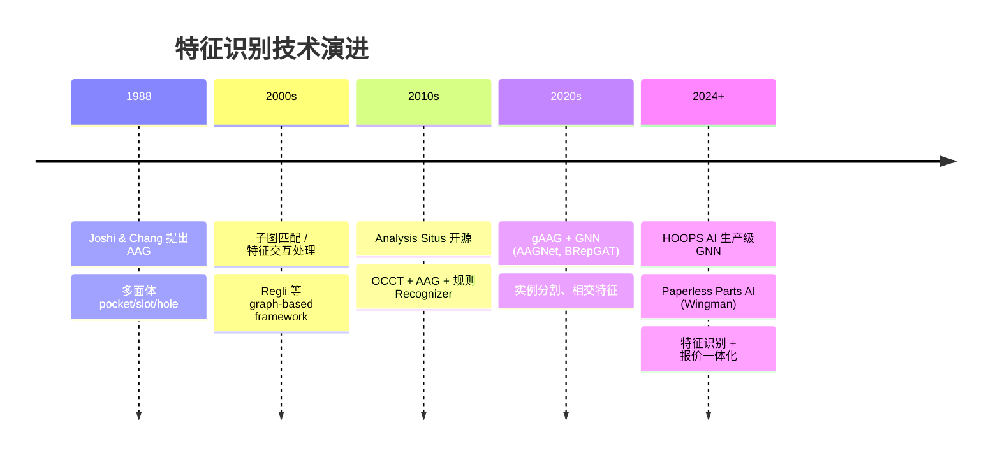
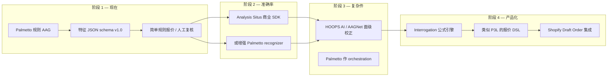

# 加工特征识别技术选型与行业参考

本文档补充 [Palmetto 算法说明](./palmetto-feature-recognition-algorithms.md)，回答三个问题：

1. **AAG（1988）是否过时？**
2. **有没有更好、更快、更准确的方法？**
3. **有哪些优质案例可参考？**

---

## 1. 核心结论

| 问题 | 答案 |
|---|---|
| AAG 过时了吗？ | **数据结构不过时**；1988 年提出的是图表示，今天仍在用。过时的是「只用简单规则、只支持多面体」的早期实现 |
| 有没有更好的方法？ | **有**，但取决于目标：复杂相交特征 → GNN/商业 SDK；快速上线 → 规则 AAG；完整报价 → SaaS 产品 |
| Palmetto 处于什么位置？ | **开源规则 + AAG** 路线，适合 MVP；不是工业界最强方案，但性价比最高 |

---

## 2. 方法谱系对比

| 路线 | 速度 | 精度 | 可解释性 | 部署难度 | 典型场景 |
|---|---|---|---|---|---|
| **AAG + 规则**（Palmetto / Analysis Situs 开源） | ⭐⭐⭐⭐⭐ | ⭐⭐⭐ | ⭐⭐⭐⭐⭐ | ⭐⭐ | 快速验证、标准 prismatic 件 |
| **AAG + 规则 + 子图同构**（Analysis Situs 商业 SDK） | ⭐⭐⭐⭐ | ⭐⭐⭐⭐ | ⭐⭐⭐⭐ | ⭐⭐⭐ | 沉头孔、相交孔、复杂 pocket |
| **B-Rep 图 + GNN/Transformer**（AAGNet、BRepGAT、HOOPS AI） | ⭐⭐⭐ | ⭐⭐⭐⭐⭐ | ⭐⭐ | ⭐⭐⭐⭐ | 大规模、特征类型多、有标注数据 |
| **体素/点云 + 深度学习**（UV-Net 等） | ⭐⭐ | ⭐⭐⭐ | ⭐ | ⭐⭐⭐ | 学术研究为主，工业较少 |
| **物理仿真 + 特征**（aPriori） | ⭐⭐ | ⭐⭐⭐⭐⭐ | ⭐⭐⭐⭐ | ⭐⭐⭐⭐⭐ | 企业 should-cost，非轻量 API |
| **SaaS 几何 Interrogation**（Paperless Parts） | ⭐⭐⭐⭐ | ⭐⭐⭐⭐ | ⭐⭐⭐ | ⭐⭐⭐⭐ | 机加工报价 SaaS |

**怎么选：**

- **更快** → 规则 AAG（Palmetto 5 MB STEP ~5 s 即为例证）
- **更准（复杂件）** → GNN 或 Analysis Situs / HOOPS AI 商业 SDK
- **直接能报价** → Paperless Parts、aPriori 等完整产品

---

## 3. AAG 从 1988 到今天：演进脉络

**关键认知：** 近年论文和工业产品 **并没有抛弃 AAG**，而是在 AAG / gAAG 上叠加：

- 更丰富的面/边属性（角度直方图、邻域统计）
- 规则 + **子图同构**（Analysis Situs 商业版）
- **图神经网络** 学习特征模式（AAGNet、HOOPS AI）

Palmetto 属于 2010s–2020s 开源规则链路的实现，尚未纳入 ML 层。

---

## 4. 学术 / 开源参考（B-Rep 图 + 深度学习）

适合研究「比规则 AAG 更准」的方向，尤其 **特征相交、实例分割** 场景。

| 项目 | 方法 | 亮点 | 链接 |
|---|---|---|---|
| **AAGNet** | gAAG + GNN | 语义/实例/底面多任务分割；MFInstSeg 60k+ STEP | [GitHub](https://github.com/whjdark/AAGNet) |
| **BRepGAT** | B-Rep 图注意力网络 | MFCAD++ 上面分割 ~99.1% | [Korea Univ. 论文页](https://pure.korea.ac.kr/en/publications/brepgat-graph-neural-network-to-segment-machining-feature-faces-i/) |
| **BrepMFR** | Transformer + GAT | 合成数据训练 + 迁移到真实 CAD | [RCIM 2024 PDF](https://quaoar.su/files/papers/feature_recognition/1-s2.0-S0167839624000529-main.pdf) |
| **Sheet-metalNet** | GIN + 增量学习 | 钣金特征识别 | [Nature SR 2024](https://www.nature.com/articles/s41598-024-61443-2) |

**优势：** 相交特征、复杂拓扑、可扩展新特征类型（需标注数据）  
**劣势：** 需要 GPU 训练、真实 STEP 标注贵、黑盒、工程化门槛高

---

## 5. 商业 SDK 参考（可替换 / 增强 Palmetto）

与 Palmetto 同系（OCCT + AAG），迁移成本相对 GNN 更低。

| 产品 | 能力 | 链接 |
|---|---|---|
| **Analysis Situs 开源** | 孔、圆角、型腔、AAG 构建 | [特征识别框架](https://analysissitus.org/features/features_feature-recognition-framework.html) |
| **Analysis Situs 商业 CNC SDK** | Milling/turning、螺纹、DFM、glTF 特征标注 | [CNC milling features](https://analysissitus.org/features/features_recognize-cnc-milling-features.html) |
| **Analysis Situs 孔识别 SDK** | 沉头/沉孔/相交孔、hardFeatureMode | [Drilled holes SDK](https://analysissitus.org/featuresext/features_cnc-drilled-holes.html) |
| **HOOPS AI — GraphNodeClassification** | 生产级 GNN+Transformer，按面分类 | [HOOPS AI 文档](https://docs.techsoft3d.com/hoops/ai/programming_guide/feature-rec.html) |
| **Siemens NX Feature-Based Machining** | CAD 内特征 → 自动刀路（CAM 向） | [NX Manufacturing](https://www.plm.automation.siemens.com/global/en/products/manufacturing/nx-manufacturing.html) |

**Analysis Situs 识别原理（规则 + 同构混合）：**

> 规则 Recognizer 先缩小搜索空间 → 子图同构提取沉头角、直径等属性

- [识别原理文档](https://analysissitus.org/features/features_recognition-principles.html)
- [孔识别详解](https://analysissitus.org/features/features_recognize-drill-holes.html)

---

## 6. 自动报价产品参考（特征 + 定价一体化）

最接近 Shopify 自动报价终局形态的案例。

### Paperless Parts（机加工 SaaS，强烈推荐研究）

| 模块 | 作用 |
|---|---|
| **Interrogations** | 对 STEP/CAD 跑几何算法：孔、pocket、体积、装夹、钣金等 |
| **P3L** | 用 interrogation 结果驱动报价公式（类似 DSL） |
| **Wingman AI** | 从图纸/PDF 提取材料、规格、螺纹、表面处理 |

| 资源 | 链接 |
|---|---|
| Interrogations 基础 | https://help.paperlessparts.com/s/article/interrogations-basics |
| 支持文件格式 | https://help.paperlessparts.com/s/article/supported-file-types |
| CNC 快速报价 Demo | https://www.paperlessparts.com/resources/rapidly-quote-cnc-machining-jobs/ |
| Wingman AI | https://www.paperlessparts.com/product-update/wingman-ai-powered-quoting-assistant/ |

**可借鉴：** 「几何 interrogation → 公式报价 → 人工复核警告」的产品结构，而非单纯输出特征 JSON。

### aPriori（企业 should-cost）

| 特点 | 说明 |
|---|---|
| 输入 | 3D CAD（含 NX、STEP 等） |
| 方法 | 物理仿真 + 数字工厂 + 特征驱动路由 |
| 输出 | 工序级成本、周期、可制造性 |
| 定位 | 大型企业 Design-to-Cost，非轻量 API |

| 资源 | 链接 |
|---|---|
| 官网 | https://www.apriori.com/win-more-profitable-business/ |
| Digital Factories | https://www.apriori.com/blog/apriori-digital-factories-revolutionizing-cost-and-manufacturability/ |

### 即时报价平台（Xometry / Fictiv 等）

- 面向 C 端.upload → 即时价
- 算法不开放，通常 **简化几何 + 规则 + 人工复核**
- 可参考 UX，不宜参考底层算法

---

## 7. Palmetto vs 其他方案（本项目视角）

| 维度 | Palmetto（当前） | Analysis Situs SDK | AAGNet / HOOPS AI | Paperless Parts |
|---|---|---|---|---|
| 自建可控 | ✅ | 部分（SDK 授权） | 部分 | ❌ SaaS |
| STEP 精确 B-Rep | ✅ | ✅ | ✅ | ✅ |
| 孔/型腔 baseline | ✅ 已验证 | ✅ 更强 | ✅ 更强 | ✅ 生产级 |
| 相交特征 / 螺纹 | ❌ 弱 | ✅ | ✅ | ✅ |
| 装夹 / 刀具可达性 | ❌ | 部分 DFM | 部分 | ✅ |
| 定价引擎 | ❌ | ❌ | ❌ | ✅ P3L |
| 典型耗时（5 MB STEP） | ~5 s | 类似 | 推理快，前期训练重 | 云端 |

**SKS CHASSI B V2.stp 实测（Palmetto）：** 6 孔、455 圆角、6 型腔、~5.5 s — 说明规则 AAG 对「标准机加工件」baseline 可用。

---

## 8. 推荐升级路径（Shopify 自动报价）

| 阶段 | 目标 | 动作 | 周期估计 |
|---|---|---|---|
| **1（当前）** | 跑通链路 | Palmetto + `analyze-step-features` + 人工复核 | 已完成 |
| **2** | 提高准确率 | 评估 Analysis Situs CNC SDK；或 fork 增强 Palmetto 孔/口袋识别 | 2–4 周评估 |
| **3** | 复杂相交件 | 引入 GNN 做 face-level 二次分类；或 HOOPS AI POC | 1–3 月 |
| **4** | 自动报价 | 自建 interrogation + 公式引擎（参考 Paperless P3L 思路） | 2–4 月 |

---

## 9. 决策建议（按目标）

| 你的目标 | 推荐 |
|---|---|
| **3 个月内 Shopify 上线** | 继续 Palmetto；复杂件标记 `requiresManualReview` |
| **减少误识别** | Analysis Situs 商业 SDK POC（与 Palmetto 同技术栈） |
| **长期技术壁垒** | AAGNet 思路 + 自建标注集 + face-level ML |
| **参考产品形态** | Paperless Parts Interrogations + P3L |
| **企业级 should-cost** | aPriori（成本高，Overkill for Shopify MVP） |

---

## 10. 延伸阅读

### 经典论文

| 文献 | 链接 |
|---|---|
| Joshi & Chang (1988) — AAG 原始论文 | [Penn State](https://pure.psu.edu/en/publications/graph-based-heuristics-for-recognition-of-machined-features-from-/) |
| Regli et al. (2001) — 图特征识别框架 | [ACM DOI](https://dl.acm.org/doi/10.1145/376957.376980) |
| Slyadnev et al. (2020) — Analysis Situs AAG | [Analysis Situs AAG 页](https://analysissitus.org/features/features_aag.html) |

### 综述

| 文献 | 链接 |
|---|---|
| Automatic Feature Recognition: CAD/CAM 集成综述 (2024) | [ASTM SSMS](https://doi.org/10.1520/SSMS20230016) |
| GraphiCon 2017 — AAG 方法概述 | [PDF](https://www.graphicon.ru/html/2017/papers/pp319-322.pdf) |

### 本项目相关文档

| 文档 | 说明 |
|---|---|
| [palmetto-feature-recognition-algorithms.md](./palmetto-feature-recognition-algorithms.md) | Palmetto 算法实现详解 |
| `utils/palmetto-client.js` | HTTP 客户端 |
| `utils/machining-features.js` | 特征 schema 规范化 |

---

## 11. 修订记录

| 日期 | 说明 |
|---|---|
| 2026-06-24 | 初版：方法对比、行业案例、升级路径 |
