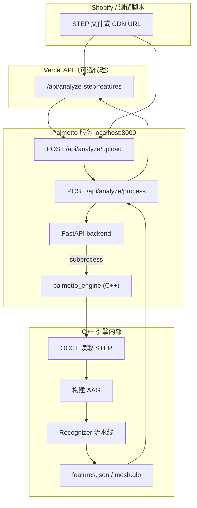

# Palmetto 加工特征识别算法说明

本文档介绍 Shopify 自动报价链路中使用的 **Palmetto** 服务如何实现 STEP 模型的加工特征识别，包括理论基础、代码实现位置、API 调用方式，以及进一步阅读的参考资料。

> **适用版本**：Palmetto C++ 引擎（`palmetto_engine`）+ FastAPI 后端  
> **本地路径**：`E:\Palmetto`  
> **集成代码**：本仓库 `utils/palmetto-client.js`、`utils/machining-features.js`、`api/analyze-step-features.js`

---

## 1. 核心结论（30 秒版）

| 问题 | 答案 |
|---|---|
| 是否使用 AI/机器学习？ | **否**。基于 CAD 精确几何（B-Rep）+ 图论规则推理 |
| 核心数据结构 | **AAG（Attributed Adjacency Graph，属性邻接图）** |
| 几何内核 | **OpenCASCADE (OCCT)** |
| 方法论来源 | **Analysis Situs** 图特征识别框架 |
| 识别方式 | 多个 **Recognizer（识别器插件）** 在 AAG 上执行启发式规则与图遍历 |
| 典型耗时 | 5 MB 级 STEP 约 **5–30 秒**（视面数与模块而定） |

---

## 2. 系统架构



**三层分工：**

1. **C++ 引擎**（`E:\Palmetto\core\apps\palmetto_engine`）：真正的几何分析与特征识别  
2. **FastAPI 后端**（`E:\Palmetto\backend`）：HTTP 封装，调用 C++ 二进制  
3. **Shopify 集成层**（本仓库）：上传 orchestration、特征 JSON 规范化、写入 Draft Order

---

## 3. 理论基础：为什么是 AAG？

### 3.1 B-Rep 与「哑几何」问题

STEP 文件保存的是 **边界表示（Boundary Representation, B-Rep）**：面、边、顶点及其精确曲面方程。  
对 CAM/报价系统而言，这类模型是「哑几何」——有形状，但没有「这是一个 M6 通孔」「这是一个口袋」的语义。

### 3.2 AAG 的作用

**属性邻接图（AAG）** 最早由 Joshi & Chang (1988) 提出，用于从 B-Rep 自动识别加工特征：

- **节点** = 拓扑面（Face）  
- **边（弧）** = 两面相邻关系（共享一条几何边）  
- **属性** = 二面角凸凹性、曲面类型、面积、圆柱半径等  

在 AAG 上，**一个加工特征 ≈ 满足特定拓扑/几何模式的一个子图**。  
Analysis Situs 开源框架系统化了这一思路；Palmetto 在 OCCT 上实现了同类 pipeline。

### 3.3 与 mesh/AI 方法的对比

| 方法 | 输入 | 精度 | 本方案 |
|---|---|---|---|
| STL/点云 + 深度学习 | 三角网格 | 低，无精确参数 | 未采用 |
| 体素 / SDF | 体积采样 | 中，计算昂贵 | 可选模块，默认关闭 |
| **B-Rep + AAG + 规则** | 精确 CAD | **高，可输出直径/深度** | **采用** |

---

## 4. 处理流水线（逐步）

### 步骤 1：加载 STEP（OpenCASCADE）

**源码**：`core/apps/palmetto_engine/engine.cpp` → `load_step()`

```
STEPControl_Reader → TransferRoots() → TopoDS_Shape
```

支持格式：`.step` / `.stp`、`.iges` / `.igs`、`.brep`

### 步骤 2：构建 AAG

**源码**：`core/apps/palmetto_engine/aag.cpp` → `AAG::Build()`

1. **PartitionSolids**：检测多实体/装配  
2. **BuildFaceIndex**：遍历 `TopAbs_FACE`，为每个面分配整数 ID  
3. **ComputeFaceAttributes**：对每个面调用 `BRepAdaptor_Surface`，分类曲面类型并提取参数：

   | OCCT 类型 | 提取属性 |
   |---|---|
   | `GeomAbs_Plane` | 法向、平面位置 |
   | `GeomAbs_Cylinder` | 轴、半径 |
   | `GeomAbs_Cone` | 轴、半角 |
   | `GeomAbs_Sphere` | 球心、半径 |
   | `GeomAbs_Torus` | 主/副半径（圆角常见） |

4. **BuildAdjacency**：用 `TopExp::MapShapesAndAncestors` 找共享边的面对，计算 **二面角**

### 步骤 3：二面角（Dihedral Angle）与凸凹性

**源码**：`aag.cpp` → `ComputeDihedralAngle()`

对共享边 `edge` 上的两点，分别计算两面法向 `N1`、`N2`，在垂直于边的平面内测量夹角：

- **|angle| > 177°** → 光滑边（Smooth），常见于圆角过渡  
- **angle < 0** → 凸边（Convex），材料向外凸出  
- **angle > 0** → 凹边（Concave），材料向内凹陷  

这是区分 **孔 vs 凸台 vs 口袋边界 vs 圆角** 的核心几何量。

### 步骤 4：Recognizer 流水线

**源码**：`engine.cpp` → `recognize_features()`

识别器按固定顺序运行，并维护 **已分类面集合**，避免重复归类：

```
1. recognize_fillets   （圆角，优先）
2. recognize_chamfers  （倒角）
3. recognize_thin_walls（薄壁）
4. recognize_holes     （孔，排除已标为圆角的面）
5. recognize_shafts    （轴/凸台）
6. recognize_cavities  （型腔/口袋）
```

### 步骤 5：导出结果

**源码**：`json_exporter.cpp`

| 文件 | 内容 |
|---|---|
| `features.json` | 识别到的特征列表 |
| `aag.json` | 邻接图（可视化/调试） |
| `meta.json` | 面数、耗时等元数据 |
| `mesh.glb` | 显示用三角网格 |
| `topology.json` | 拓扑几何 |

---

## 5. 各识别器算法详解

### 5.1 圆角识别器（FilletRecognizer）

**源码**：`fillet_recognizer.cpp`  
**模块名**：`recognize_fillets`

**算法：**

1. 收集所有 **圆柱面** 和 **圆环面（Torus）**  
2. 过滤：半径 < `max_radius`（默认 10 mm）  
3. 关键判别：**边为 1/4 圆弧（90°）**，而非孔的半圆（180°）  
4. 输出：`type=fillet`，`params.radius_mm`，关联 `faces[]`

**设计原因**：孔和圆角都是圆柱面，必须先识别圆角，否则大量 R 角会被误判为孔。

### 5.2 孔识别器（HoleRecognizer）

**源码**：`hole_recognizer.cpp`  
**模块名**：`recognize_holes`

**算法：**

1. 遍历所有圆柱面（跳过已被标为圆角的面）  
2. **IsInternal()**：在面中心采样法向；若法向指向轴心 → 内表面（孔）  
3. **HasConcaveCircularEdges()**：要求凹的圆形边，排除圆角  
4. **FindCoaxialCylinders()**：合并同轴圆柱 → 沉头孔（counterbored）  
5. 输出：`type=hole`，`subtype=simple|counterbored`，`params.diameter_mm`，`params.axis_x/y/z`

**示例**（`SKS CHASSI B V2.stp`）：识别到 6 个孔，含沉头孔，直径约 5.41 mm。

### 5.3 轴/凸台识别器（ShaftRecognizer）

**源码**：`shaft_recognizer.cpp`  
**模块名**：`recognize_shafts`

与孔识别器 **镜像逻辑**：

- 外表面圆柱（法向背离轴心）  
- 凸圆形边  
- 同轴合并 → 阶梯轴（stepped shaft）

### 5.4 型腔/口袋识别器（CavityRecognizer）

**源码**：`cavity_recognizer.cpp`  
**模块名**：`recognize_cavities`

**算法（图搜索 / BFS）：**

1. **FindSeedFaces()**：邻居中 ≥60% 为凹边 → 种子面（可能在口袋内部）  
2. **PropagateFromSeed()**：BFS 扩展  
   - 可穿过：光滑边、凹边  
   - 不可穿过：**凸边**（口袋开口边界）  
3. **ValidateCavity()**：  
   - 面数 ≥ 3  
   - 面数 < 总面数 25%  
   - 边界比例达标  
4. 估算 `estimated_volume_mm3`、`total_area_mm2`

这是典型的 **子图连通分量提取**，在 AAG 上找「凹面连通区域」。

### 5.5 倒角识别器（ChamferRecognizer）

**源码**：`chamfer_recognizer.cpp`  
**模块名**：`recognize_chamfers`（默认流程可选）

识别小宽度平面 bevel：`type=chamfer`，`params.width_mm`。

### 5.6 薄壁识别器（ThinWallRecognizer V2）

**源码**：`thin_wall_recognizer_v2.cpp`  
**模块名**：`recognize_thin_walls`

基于邻接图分析壁厚低于阈值的区域，用于 DFM 而非标准报价特征（默认分析流程未启用）。

---

## 6. HTTP API（当前版本）

> 旧文档中的 `/api/recognition/*` 路径 **已废弃**，以下为实际可用接口。

| 方法 | 路径 | 说明 |
|---|---|---|
| GET | `/health` | 服务健康检查 |
| GET | `/api/analyze/modules` | 列出可用识别模块 |
| GET | `/api/analyze/health` | C++ 引擎是否可用 |
| POST | `/api/analyze/upload` | 上传 STEP（multipart `file`） |
| POST | `/api/analyze/process` | 运行特征识别 |
| GET | `/api/analyze/{model_id}/artifacts/{filename}` | 下载 features.json 等 |

**`/api/analyze/process` 请求体示例：**

```json
{
  "model_id": "uuid-from-upload",
  "modules": "recognize_holes,recognize_shafts,recognize_fillets,recognize_cavities",
  "analyze_thickness": false,
  "enable_dfm_geometry": false
}
```

**Swagger 交互文档**：http://localhost:8000/docs

---

## 7. 特征 JSON 格式

C++ 引擎原始输出（`features.json`）：

```json
{
  "model_id": "...",
  "units": "mm",
  "features": [
    {
      "id": "hole_0001",
      "type": "hole",
      "subtype": "counterbored",
      "faces": [10, 11, 12],
      "edges": [],
      "params": {
        "diameter_mm": 5.41,
        "radius_mm": 2.705,
        "axis_x": 0,
        "axis_y": 0,
        "axis_z": 1
      },
      "source": "hole_recognizer",
      "confidence": 0.95
    }
  ]
}
```

Shopify 集成层（`machining-features.js`）规范化为 schema v1.0：

```json
{
  "schemaVersion": "1.0",
  "status": "ok",
  "summary": {
    "holeCount": 6,
    "shaftCount": 0,
    "filletCount": 455,
    "cavityCount": 6
  },
  "features": {
    "holes": [...],
    "shafts": [...],
    "fillets": [...],
    "cavities": [...]
  },
  "requiresManualReview": false
}
```

映射逻辑见 `utils/palmetto-client.js` → `mapPalmettoFeature()`。

---

## 8. 本地验证

```powershell
# 1. 确保 Palmetto Docker 在运行
curl.exe http://localhost:8000/health

# 2. 进入 Shopify 项目
cd "E:\1\+小批量定制化服务\shopify\1\theme_export__rt08kw-se-myshopify-com-horizon__02SEP2025-0602pm"

# 3. 安装依赖（首次）
npm install

# 4. 运行测试
$env:PALMETTO_SERVICE_URL="http://localhost:8000"
node scripts/test-palmetto-features.mjs "E:\1\+小批量定制化服务\+CNC\SKS CHASSI B V2.stp"
```

**已验证样例结果**（SKS CHASSI B V2.stp，5.1 MB）：

| 特征 | 数量 |
|---|---|
| 孔 | 6 |
| 轴 | 0 |
| 圆角 | 455 |
| 型腔 | 6 |
| 耗时 | ~5.5 s |

---

## 9. 已知局限

1. **规则/heuristic，非完备**：复杂自由曲面、建模不规范时可能漏检或误检  
2. **特征 ≠ 工序**：识别到 pocket 不自动等于刀具路径或加工时间  
3. **置信度为规则打分**，不是统计模型概率  
4. **未覆盖**：螺纹、T 槽、筋板阵列等需新增 Recognizer  
5. **大文件 + 全模块**：启用 `analyze_thickness`、SDF 等会显著增加耗时  
6. **部署**：C++ 引擎需独立宿主机/Docker，Vercel 仅作 HTTP 代理（`PALMETTO_SERVICE_URL`）

---

## 10. 参考文献与延伸阅读

### 10.1 核心理论（AAG 与特征识别）

| 资料 | 链接 | 说明 |
|---|---|---|
| Joshi & Chang (1988) — AAG 原始论文 | [Penn State 出版物页](https://pure.psu.edu/en/publications/graph-based-heuristics-for-recognition-of-machined-features-from-/) | 提出 AAG 用于加工特征识别 |
| Analysis Situs — AAG 介绍 | [features_aag.html](https://analysissitus.org/features/features_aag.html) | AAG 结构与 JSON 导出 |
| Analysis Situs — 特征识别框架 | [features_feature-recognition-framework.html](https://analysissitus.org/features/features_feature-recognition-framework.html) | 图特征识别范式总览 |
| Analysis Situs — 识别原理 | [features_recognition-principles.html](https://analysissitus.org/features/features_recognition-principles.html) | 规则识别 vs 子图同构 |
| Analysis Situs — AAG API | [asiAlgo_AAG Class Reference](https://analysissitus.org/refdoc/classasi_algo___a_a_g.html) | SDK 级 AAG 文档 |
| Regli et al. (2001) — 图框架 | [ACM DOI](https://dl.acm.org/doi/10.1145/376957.376980) | 子图匹配与特征交互 |

### 10.2 几何内核与 CAD 标准

| 资料 | 链接 | 说明 |
|---|---|---|
| OpenCASCADE 官方 | [dev.opencascade.org](https://dev.opencascade.org/) | B-Rep 内核，STEP 读写 |
| OCCT — BRepAdaptor_Surface | [官方文档](https://dev.opencascade.org/doc/refman/html/class_b_rep_adaptor___surface.html) | 曲面类型分类 |
| STEP ISO 10303 | [ISO 10303 概述](https://www.iso.org/standard/63158.html) | STEP 交换标准 |

### 10.3 Palmetto 项目内文档

| 文档 | 路径 |
|---|---|
| 架构说明 | `E:\Palmetto\docs\architecture.md` |
| AAG 规范 | `E:\Palmetto\docs\aag-specification.md` |
| 识别器开发指南 | `E:\Palmetto\docs\recognizers.md` |
| API 参考（部分路径已过时，以 `/api/analyze/*` 为准） | `E:\Palmetto\docs\api-reference.md` |

### 10.4 综述文献（可选深入）

| 资料 | 链接 |
|---|---|
| Automatic Feature Recognition: CAD/CAM 集成综述 (2024) | [ASTM SSMS 期刊](https://doi.org/10.1520/SSMS20230016) |
| GraphiCon 2017 — AAG 方法概述 PDF | [graphicon.ru PDF](https://www.graphicon.ru/html/2017/papers/pp319-322.pdf) |

### 10.5 技术选型与行业对比

Palmetto 在工业界处于什么位置？有没有比 AAG 更好的方法？有哪些报价产品可参考？

详见：**[feature-recognition-landscape.md](./feature-recognition-landscape.md)**（方法谱系、学术/商业/SaaS 案例、升级路径）

---

## 11. 源码索引（快速定位）

| 组件 | 文件 |
|---|---|
| 引擎入口 | `E:\Palmetto\core\apps\palmetto_engine\main.cpp` |
| 识别调度 | `E:\Palmetto\core\apps\palmetto_engine\engine.cpp` |
| AAG 构建 | `E:\Palmetto\core\apps\palmetto_engine\aag.cpp` |
| 孔 | `hole_recognizer.cpp` |
| 轴 | `shaft_recognizer.cpp` |
| 圆角 | `fillet_recognizer.cpp` |
| 倒角 | `chamfer_recognizer.cpp` |
| 型腔 | `cavity_recognizer.cpp` |
| JSON 导出 | `json_exporter.cpp` |
| FastAPI 路由 | `E:\Palmetto\backend\app\api\routes\analyze.py` |
| Shopify 客户端 | 本仓库 `utils/palmetto-client.js` |
| 特征规范化 | 本仓库 `utils/machining-features.js` |

---

## 12. 修订记录

| 日期 | 说明 |
|---|---|
| 2026-06-24 | 初版：基于 Palmetto 实际 C++ 实现与 SKS CHASSI B V2.stp 验证结果编写 |
| 2026-06-24 | 增加指向 [feature-recognition-landscape.md](./feature-recognition-landscape.md) 的交叉引用 |
